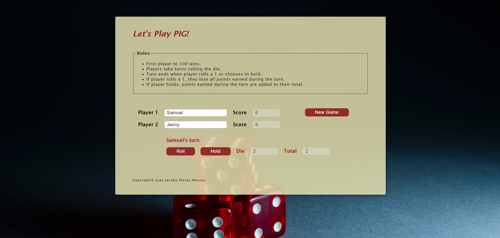

# 🐷 PIG Game

## 📌 Project Overview

The **PIG Game** is an interactive, two-player dice game where players compete to accumulate 100 points first. Players roll a die to earn points but risk losing their turn score if they roll a 1. They can "hold" to add their turn score to their total, transferring the turn to the opponent.

---

## 🌍 Live Demo

🎮 **Try it out here**: [PIG Game Live Demo](https://pig-game-tau-henna.vercel.app)

---

## 🚀 Features

- 👥 **Player Name Input**: Users enter names for Player 1 and Player 2.
- 🎲 **Dice Roll Simulation**: Generates random numbers between 1 and 6 for each roll.
- 🔄 **Dynamic Turn Display**: Highlights the current player's turn.
- 📝 **Score Tracking**: Tracks both turn scores and total scores for players.
- 🎉 **Winner Announcement**: Declares the winner when a player reaches or exceeds 100 points, with a congratulatory message.
- 🔄 **New Game Option**: Allows players to reset scores and start over.

---

## 📌 Project Purpose

This project demonstrates:

- **Game Development with JavaScript**: Implementing interactive gameplay using JavaScript and jQuery.
- **Object-Oriented Programming (OOP)**: Utilizing JavaScript classes and objects for structured game logic.
- **User Interaction & Experience**: Providing an engaging, competitive experience with real-time updates.
- **DOM Manipulation**: Using JavaScript to dynamically update UI elements based on game state.
- **Responsive Web Design**: Ensuring compatibility across different screen sizes and devices.
- **Scalability & Future Enhancements**: Laying a foundation for additional features like custom score limits, saved game states, and animations.

---

## 📂 Project Structure

```
📝 pig_game
 ├── 📝 index.html          # Main HTML file for the game interface
 ├── 📝 pig.css             # Stylesheet for layout and design
 ├── 📝 pig.js              # Main JavaScript file for UI interactions
 ├── 📝 library_die.js      # Die class for dice roll simulation
 ├── 📝 library_pig.js      # Pig class for player logic
 ├── 📝 library_game.js     # Game object for controlling the game flow
```

---

## 🛠 Technologies Used

- **🌐 HTML5**: Structures the game interface and layout.
- **🎨 CSS3**: Provides a visually appealing design with responsive elements.
- **📚 JavaScript (ES6)**: Manages game logic, interactions, and updates.
- **🔄 jQuery**: Simplifies DOM manipulation and event handling.
- **🎮 Object-Oriented Programming**: Implements classes (`Die`, `Pig`) and an object (`game`) for structured logic.

---

## 🏃‍♂️ How to Play

1. **Enter Player Names**:
   - Input names for Player 1 and Player 2.

2. **Start the Game**:
   - Click **"New Game"** to initialize scores and begin.

3. **Take Turns**:
   - Click **"Roll"** to roll the die and add the result to your turn score (unless a 1 is rolled).
   - Click **"Hold"** to save your turn score to your total and pass the turn to your opponent.

4. **Win Condition**:
   - The game announces the winner when a player reaches or exceeds 100 points.
   - The "Roll" and "Hold" buttons are disabled until a new game starts.

5. **New Game**:
   - Click **"New Game"** to reset the game and play again.

---

## 📝 Code Highlights

- **`Die` Class** (`library_die.js`):
  - Simulates rolling a die by generating random numbers between 1 and 6.

- **`Pig` Class** (`library_pig.js`):
  - Manages each player's turn score, total score, and dice roll validation.

- **`game` Object** (`library_game.js`):
  - Controls the game flow, manages player turns, validates input, and checks for a winner.

---

## 🌟 Future Improvements

- 🎮 **Custom Winning Score**: Allow users to set the target score.
- 💾 **Save Game State**: Add functionality to save and resume games.
- 🎧 **Sound Effects**: Add audio feedback for rolls, holds, and win announcements.
- 🎭 **Enhanced Visuals**: Introduce animations for dice rolls and winner celebration.

---

## 🎭 Screenshots  

| Pig Game |  
|--------------|  
|  |  

---

## 📝 License

This project was developed for educational purposes as part of a **college assignment**.

---

💼 **Author:** Juan Jacobo Florez Monroy | 🚀 **GitHub**: [GitHub](https://github.com/jjacoboflorez95)